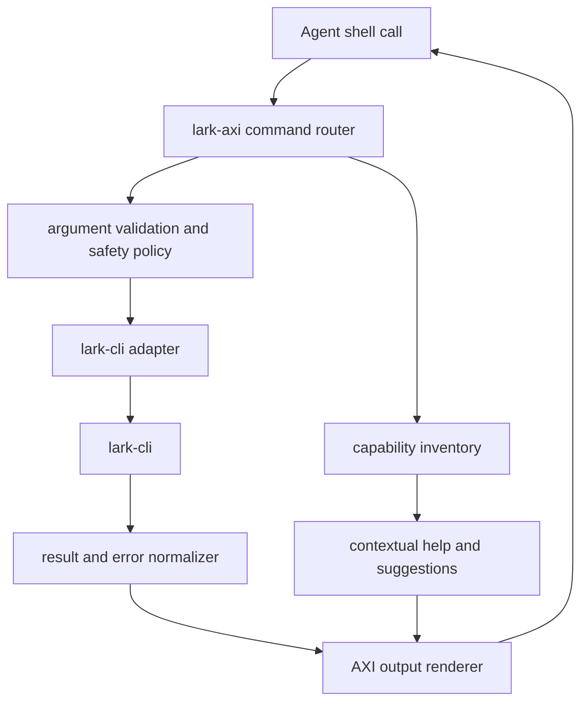
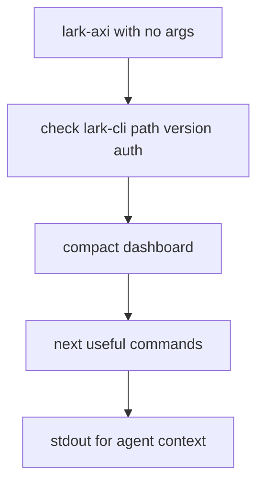

# feat: Build Lark AXI Wrapper

## Summary

Build `lark-axi`, an agent-facing CLI wrapper around the official `lark-cli`. The wrapper should preserve `lark-cli` as the execution engine while adding AXI-style output, discovery, safety, and install guidance for autonomous agents.

---

## Problem Frame

The current repository is empty, so this is a greenfield package. The user wants a Lark AXI that follows the same broad pattern as `gh-axi`: wrap the official domain CLI, reduce token overhead, avoid interactive flows during agent execution, and make common operations discoverable through compact next-step hints.

The upstream `lark-cli` is already mature and agent-aware: it is the official Lark/Feishu CLI, covers Messenger, Docs, Base, Sheets, Calendar, Mail, Tasks, Meetings, and more, and exposes a three-layer command model of shortcuts, API commands, and raw OpenAPI calls. The plan should not reimplement Feishu APIs.

---

## Requirements

**Core wrapper behavior**

- R1. Provide a `lark-axi` executable that delegates to `lark-cli` for all Feishu operations.
- R2. Emit token-efficient stdout by default, with small schemas, explicit empty states, truncation hints, and contextual next-step help.
- R3. Normalize `lark-cli` results and errors into stable AXI contracts so agents can branch without parsing raw CLI noise.
- R4. Keep every command non-interactive during agent execution; missing inputs fail with structured usage errors.

**Capability coverage**

- R5. Start with command-level coverage for high-value agent workflows: auth status, calendar agenda, IM search/send, Docs fetch/create, Drive search, Base records, Sheets info, Task list, and raw fallback. Keep Markdown update/fetch, Drive download/upload, task writes, and Base/Sheets writes raw-first until command evidence lands.
- R6. Preserve an escape hatch to `lark-cli api` and `lark-cli schema` for uncovered Feishu APIs.
- R7. Generate or maintain a capability inventory from `lark-cli --help`, domain help, and schema metadata so wrapper coverage can track upstream changes.

**Safety and distribution**

- R8. Treat write operations as explicit actions with dry-run or confirmation flags where side effects are high-risk.
- R9. Ship install paths for direct `npx -y lark-axi`, optional global install, and an Agent Skill that teaches agents when to use the wrapper.
- R10. Detect local `lark-cli` version and authentication state, and surface actionable remediation without performing login automatically.

---

## Key Technical Decisions

- KTD1. Wrap, do not replace, `lark-cli`: `lark-cli` already provides official auth, scopes, API coverage, pagination, dry-run, schema introspection, and safety warnings. `lark-axi` should focus on agent ergonomics.
- KTD2. Use TypeScript and Node 20 for the first implementation: this mirrors `gh-axi`, supports `npx -y` distribution, and gives a straightforward path for spawning `lark-cli` and testing CLI contracts with Vitest.
- KTD3. Default stdout to TOON-like compact records, with JSON reserved for `--format json`: AXI guidance prioritizes token-efficient output and minimal default fields for agent calls.
- KTD4. Keep raw `lark-cli` output behind adapters: wrapper commands should return stable domain records and structured errors, while debug details stay on stderr or behind `--debug`.
- KTD5. Build a curated surface before broad proxying: direct pass-through to every `lark-cli` command would inherit human-oriented output and make the wrapper less useful than the source CLI.
- KTD6. Pin behavior to detected upstream version ranges: local `lark-cli` is `1.0.32`, while GitHub lists `1.0.57` as latest on 2026-06-23, so the wrapper needs version checks and compatibility tests.

---

## High-Level Technical Design





The wrapper has three layers: command routing, `lark-cli` execution, and AXI rendering. The inventory layer is generated or refreshed from upstream CLI help and schema metadata, then consumed by help text, coverage tests, and the optional Agent Skill.

---

## Output Structure

```text
package.json
tsconfig.json
src/
  cli.ts
  commands/
    auth.ts
    calendar.ts
    docs.ts
    drive.ts
    im.ts
    base.ts
    sheets.ts
    task.ts
    raw.ts
  lark/
    adapter.ts
    discovery.ts
    errors.ts
    version.ts
  output/
    render.ts
    truncate.ts
    toon.ts
  safety/
    policy.ts
  skill/
    generate.ts
skills/
  lark-axi/
    SKILL.md
test/
  cli.test.ts
  adapter.test.ts
  discovery.test.ts
  output.test.ts
  safety.test.ts
docs/
  plans/
```

---

## Implementation Units

### U1. Package Scaffold and CLI Entry

- **Goal:** Create the TypeScript package, binary entry point, build/test scripts, and baseline CLI router.
- **Requirements:** R1, R9.
- **Dependencies:** None.
- **Files:** `package.json`, `tsconfig.json`, `src/cli.ts`, `test/cli.test.ts`, `.gitignore`, `README.md`.
- **Approach:** Define `lark-axi` as the package binary. Use a small command parser that supports top-level home output, subcommands, `--format`, `--full`, `--debug`, and `--help`.
- **Patterns to follow:** `gh-axi` uses npm/npx distribution and a TypeScript package layout.
- **Test scenarios:** Running with `--help` prints concise command help; running with no args invokes the home/dashboard path; unknown commands return a structured usage error; the package binary resolves after build.
- **Verification:** A fresh checkout can install dependencies, build the binary, and run the CLI help without requiring Feishu auth.

### U2. Lark CLI Adapter

- **Goal:** Wrap local `lark-cli` execution with path detection, version checks, auth status, timeout handling, and normalized process results.
- **Requirements:** R1, R3, R4, R10.
- **Dependencies:** U1.
- **Files:** `src/lark/adapter.ts`, `src/lark/version.ts`, `src/lark/errors.ts`, `test/adapter.test.ts`.
- **Approach:** Spawn `lark-cli` with explicit arguments, never shell interpolation. Default to `--format json` for adapter calls when the upstream command supports it, and convert nonzero exits into structured AXI errors.
- **Patterns to follow:** `lark-cli` exposes `auth status`, `--format`, `--dry-run`, pagination flags, and schema introspection.
- **Test scenarios:** Missing `lark-cli` returns an install hint; version parsing handles local and latest-compatible strings; auth status without user token is rendered as an actionable state; command timeouts produce a retriable error; stderr does not leak into stdout.
- **Verification:** Adapter tests use fake child-process fixtures and do not require real Feishu credentials.

### U3. AXI Output Renderer

- **Goal:** Add compact output rendering with minimal list schemas, truncation, explicit empty states, and contextual help.
- **Requirements:** R2, R3.
- **Dependencies:** U1.
- **Files:** `src/output/render.ts`, `src/output/truncate.ts`, `src/output/toon.ts`, `test/output.test.ts`.
- **Approach:** Keep internal data as typed objects and render only at the boundary. Provide `--format json` for raw structured inspection and compact default output for agent use.
- **Patterns to follow:** AXI principles prefer token-efficient output, 3-4 default fields per list row, truncation with size hints, explicit empty states, and next-step suggestions.
- **Test scenarios:** Lists render only default fields unless `--fields` is supplied; long text truncates with total length and `--full` hint; empty results state zero with context; errors render on stdout in the same structured style as normal output.
- **Verification:** Snapshot tests lock the default output shape for list, detail, mutation, empty, and error responses.

### U4. Capability Discovery and Coverage Registry

- **Goal:** Build a discovery command that inventories available `lark-cli` domains, shortcuts, API commands, schema metadata, scopes, and identity requirements.
- **Requirements:** R5, R6, R7, R10.
- **Dependencies:** U2, U3.
- **Files:** `src/lark/discovery.ts`, `src/commands/raw.ts`, `test/discovery.test.ts`, `docs/capabilities.md`.
- **Approach:** Read `lark-cli --help`, selected domain help, and `lark-cli schema` output where available. Store a generated registry that marks commands as curated, pass-through, or unsupported.
- **Patterns to follow:** `lark-cli` has three command layers: shortcuts, generated API commands, and raw API calls.
- **Test scenarios:** Discovery handles new upstream domains without failing; known core domains are recognized; schema failures degrade to help-based inventory; raw API escape hatch remains available for uncovered commands.
- **Verification:** Generated capability docs clearly show wrapper coverage vs. upstream `lark-cli` coverage.

### U5. Curated Read Commands

- **Goal:** Implement first-class read-oriented AXI commands for common agent tasks across calendar, IM, Docs, Drive, Base, Sheets, and Tasks.
- **Requirements:** R2, R5, R6.
- **Dependencies:** U2, U3, U4.
- **Files:** `src/commands/calendar.ts`, `src/commands/im.ts`, `src/commands/docs.ts`, `src/commands/drive.ts`, `src/commands/base.ts`, `src/commands/sheets.ts`, `src/commands/task.ts`, `test/cli.test.ts`.
- **Approach:** Start with list/search/view commands that are safe to run and useful for context gathering. Include `--limit`, `--fields`, `--full`, `--as`, and profile forwarding where relevant.
- **Patterns to follow:** `lark-cli` supports global `--profile`, identity selection with `--as`, pagination flags, and output filters.
- **Test scenarios:** Calendar agenda returns compact event rows; IM search returns message previews with truncation; docs fetch returns metadata plus preview; Base and Sheets list commands include counts; raw API fallback is suggested when a curated command cannot cover a request.
- **Verification:** Each read command can be tested against recorded JSON fixtures from the adapter boundary.

### U6. Safe Mutation Commands

- **Goal:** Add write operations with explicit side-effect controls for sending messages and creating docs; leave markdown updates, task creation, and Base/Sheets writes raw-first until command evidence lands.
- **Requirements:** R4, R5, R8.
- **Dependencies:** U2, U3, U5.
- **Files:** `src/safety/policy.ts`, `src/commands/im.ts`, `src/commands/docs.ts`, `src/commands/base.ts`, `src/commands/sheets.ts`, `src/commands/task.ts`, `test/safety.test.ts`.
- **Approach:** Require complete flags for mutations. For high-risk actions, support dry-run previews and an explicit execution flag rather than interactive confirmation.
- **Patterns to follow:** `lark-cli` supports `--dry-run` for side-effect preview and warns that agent-driven operations act under the authorized identity.
- **Test scenarios:** Missing mutation arguments fail before invoking `lark-cli`; dry-run returns the planned action without executing; destructive or externally visible actions require explicit execution; idempotent no-op responses exit successfully.
- **Verification:** Tests prove safety policy decisions before adapter execution.

### U7. Agent Integration and Skill Generation

- **Goal:** Ship an installable Agent Skill and optional session hook guidance for Claude Code, Codex, and OpenCode.
- **Requirements:** R7, R9, R10.
- **Dependencies:** U1, U3, U4.
- **Files:** `src/skill/generate.ts`, `skills/lark-axi/SKILL.md`, `README.md`, `test/cli.test.ts`.
- **Approach:** Generate `SKILL.md` from the same command guidance used by `lark-axi` home/help output, minus live state. The skill should instruct agents to run `npx -y lark-axi` and to prefer curated commands before raw API calls.
- **Patterns to follow:** AXI guidance recommends optional session hooks for ambient context and a static Agent Skill for on-demand discovery.
- **Test scenarios:** Skill generation is deterministic; examples use non-interactive `npx -y lark-axi`; skill guidance does not drift from CLI help; README documents direct, global, and skill-based use.
- **Verification:** A build check fails when committed skill content differs from generated content.

### U8. Documentation, Compatibility, and Release Checks

- **Goal:** Document installation, authentication prerequisites, command coverage, safety model, and upstream compatibility policy.
- **Requirements:** R6, R8, R9, R10.
- **Dependencies:** U1-U7.
- **Files:** `README.md`, `docs/capabilities.md`, `docs/security.md`, `test/cli.test.ts`.
- **Approach:** State that `lark-cli` remains required and authenticated separately. Document local compatibility checks, known latest upstream version, and how users refresh `lark-cli`.
- **Patterns to follow:** `gh-axi` documents direct `npx` usage, global install, optional hooks, and the underlying CLI auth prerequisite.
- **Test scenarios:** README examples match supported commands; compatibility tests compare fixture help output against expected domains; release check validates package metadata, binary entry, and skill content.
- **Verification:** Documentation gives an agent enough information to install, authenticate, inspect state, and choose safe commands without reading source code.

---

## Scope Boundaries

### In Scope

- Build a wrapper CLI around official `lark-cli`.
- Provide curated AXI commands for common read/write workflows.
- Add compact output, structured errors, truncation, and contextual suggestions.
- Generate an Agent Skill and document optional hook guidance.
- Maintain a capability inventory that tracks upstream `lark-cli` coverage.

### Deferred to Follow-Up Work

- Benchmark Lark AXI against raw `lark-cli`, Feishu MCP, and existing Feishu skills.
- Add full command coverage for every `lark-cli` domain.
- Add organization-specific workflow shortcuts, such as meeting summary workflows or approval routing.
- Add live E2E tests against a real Feishu tenant.

### Out of Scope

- Reimplementing Feishu OpenAPI clients directly.
- Replacing the official Feishu MCP server.
- Automatic login, scope approval, or credential management beyond surfacing `lark-cli` status.
- GUI or web application work.

---

## Risks and Dependencies

- **Upstream churn:** `lark-cli` is moving quickly. The wrapper needs version detection, fixture-based compatibility tests, and graceful fallback to raw commands.
- **Credential and identity safety:** Agent operations may run under a user or bot identity. The wrapper must expose identity state and avoid hidden writes.
- **Over-wrapping risk:** If the wrapper simply proxies all commands, it adds little value. Curated commands must materially reduce token cost and follow-up calls.
- **Output contract drift:** Agents depend on stable fields. Snapshot tests should protect default output contracts.
- **Local version mismatch:** The current machine has `lark-cli 1.0.32`; GitHub lists `1.0.57` as latest on 2026-06-23. The first implementation should not assume latest-only behavior.

---

## Acceptance Examples

- AE1. Given `lark-cli` is installed but user auth is missing, when an agent runs `lark-axi`, then the output shows auth state, available bot identity, and the exact login remediation command.
- AE2. Given a calendar has upcoming events, when an agent runs `lark-axi calendar agenda`, then stdout returns compact event rows plus a suggestion to view details only when details are available.
- AE3. Given a document body is long, when an agent runs a docs view command, then stdout includes a preview, total size, and a `--full` hint.
- AE4. Given a mutation is missing required input, when an agent runs it, then the wrapper returns a usage error without invoking `lark-cli`.
- AE5. Given a high-risk write supports dry-run, when an agent omits the execution flag, then the wrapper previews the action rather than performing it.
- AE6. Given an uncovered Feishu API is needed, when an agent uses the raw escape hatch, then the wrapper delegates to `lark-cli api` and normalizes the response.

---

## Sources and Research

- `kunchenguid/axi`: AXI positions agent-native CLIs around token-efficient output, minimal schemas, truncation, structured errors, ambient context, content-first home output, and contextual disclosure.
- `kunchenguid/gh-axi`: Reference implementation wraps official `gh`, ships npm/npx usage and an Agent Skill, and exposes GitHub operations with compact output and structured error handling.
- `larksuite/cli`: Official Lark/Feishu CLI with 200+ commands, 26 AI Agent Skills, auth/status commands, shortcut/API/raw layers, output formats, pagination, dry-run, and schema introspection.
- Local machine check: `lark-cli` is installed at `/opt/homebrew/bin/lark-cli`; local version is `1.0.32`; `auth status` reports missing user token and available bot identity.
