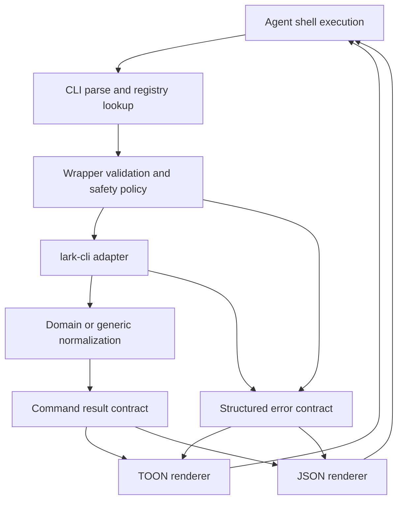
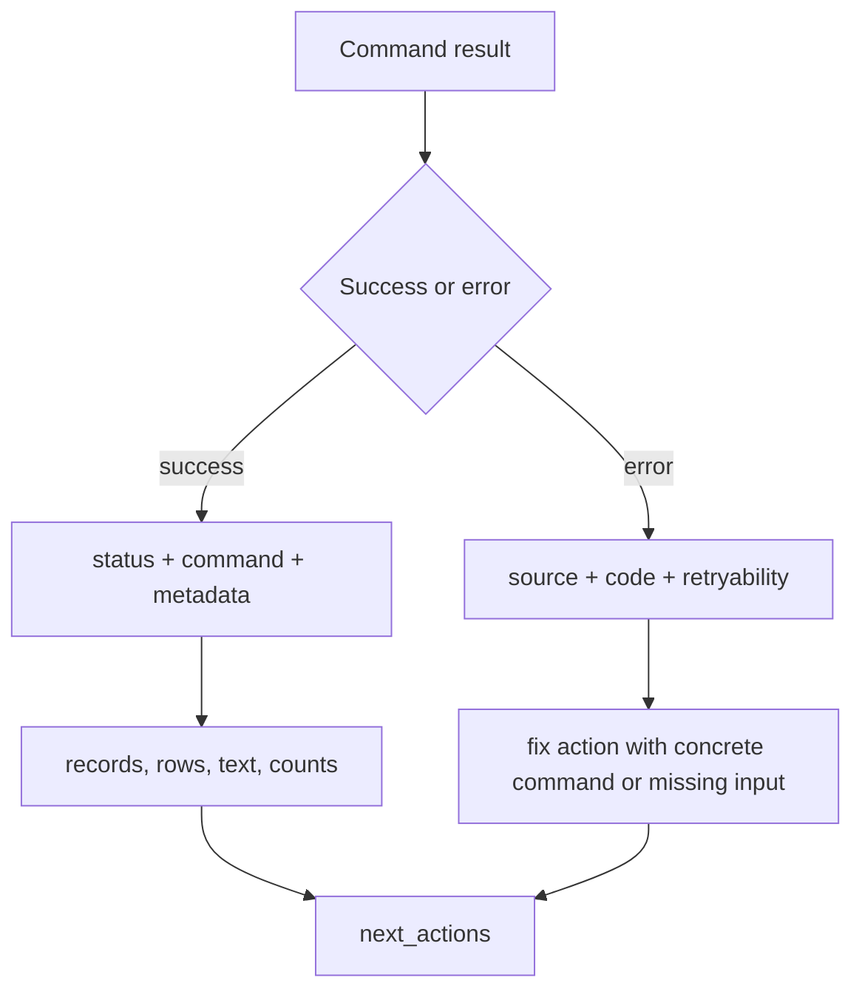
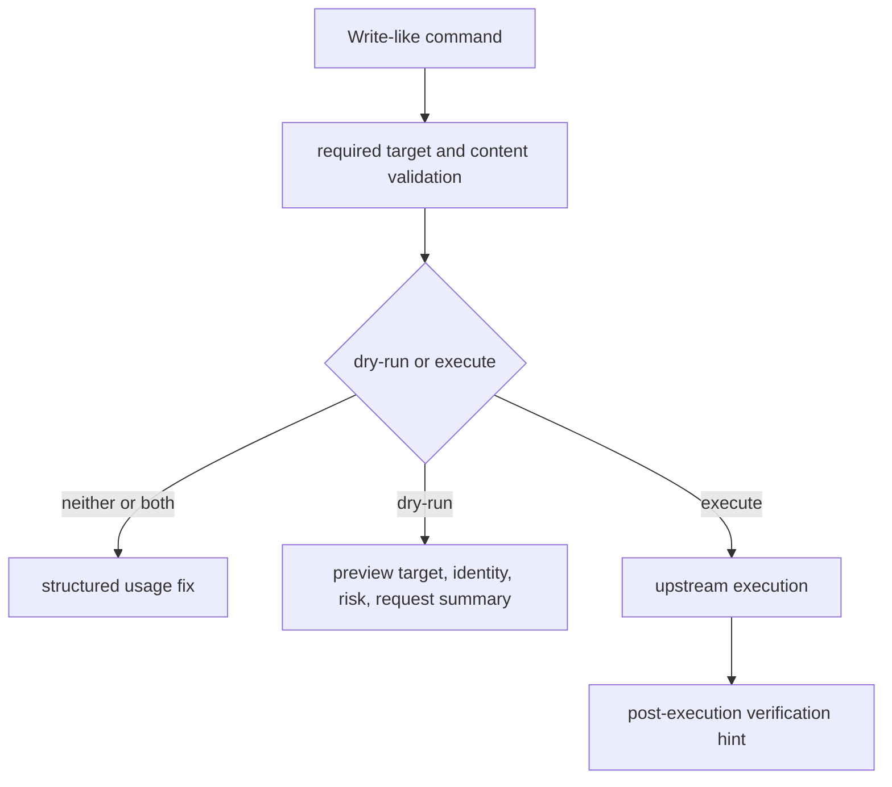

# refactor: Harden Agent-Ergonomic CLI Contracts

## Summary

Harden `lark-axi` around its root product promise: an agent-ergonomic CLI for Lark/Feishu shell execution. The plan prioritizes stable structured responses, specific fix-oriented errors, token-efficient TOON output, and autonomous-agent execution lifecycle signals before broadening command coverage.

---

## Problem Frame

`lark-axi` already positions itself as an agent-facing wrapper over `lark-cli`, and the current code has the right foundation: registry-backed commands, compact rendering, structured usage errors, mutation gates, raw fallback, generated skill guidance, and docs that describe the safety model. The remaining gap is that several core promises are still expressed as conventions rather than enforced contracts.

The most important optimization is not adding many more Lark domains. It is turning the product positioning into testable invariants so future command coverage cannot drift away from agent needs. An autonomous agent should be able to call `lark-axi`, parse every success or failure, know exactly what to do next, avoid accidental side effects, and spend few tokens doing it.

---

## Requirements

**Structured response contract**

- R1. Every successful command returns a stable response envelope with machine-readable status, command identity, sections, metadata, and next actions.
- R2. Every compact TOON response has an equivalent JSON shape so agents can switch formats without semantic loss.
- R3. List-style responses preserve `shown`, `total_observed`, and `limit`, and detail/mutation responses expose enough metadata for continuation or verification.

**Fix-oriented error model**

- R4. Every error names a specific fix action, not just a generic help string.
- R5. Error responses classify failure source as wrapper validation, missing dependency, auth/scope, upstream usage, upstream service, timeout, or unknown.
- R6. Errors stay on structured stdout, while debug stack traces and raw dependency noise remain opt-in.

**Token-efficient TOON**

- R7. Default compact output uses consistent TOON-compatible records and row blocks with bounded fields, explicit empty states, truncation metadata, and continuation hints.
- R8. Commands with large text, nested objects, or raw upstream envelopes normalize before rendering instead of leaking broad payloads.

**Autonomous shell execution**

- R9. Write-like commands expose a complete lifecycle: preflight validation, dry-run preview, explicit execution, and post-execution verification hints.
- R10. Raw fallback remains available but advertises safer curated routes when a matching command exists.
- R11. The generated Agent Skill and docs teach agents to prefer compact reads, inspect identity before writes, use dry-run first, and interpret count/error metadata.

**Coverage governance**

- R12. New curated or generic commands must prove the four contracts above through fixtures, routing tests, output snapshots, safety tests, executable help examples, and docs/skill sync.

---

## Key Technical Decisions

- KTD1. **Contract-first before coverage-first:** The next optimization pass should harden the cross-command response, error, output, and safety contracts before adding broad Lark API coverage. This protects agent ergonomics as the registry grows.
- KTD2. **Envelope at the render boundary:** Keep domain commands returning typed documents, but introduce a stricter command-result contract before rendering so compact and JSON output share the same semantics.
- KTD3. **Errors carry fix actions as data:** Replace free-form `help` as the only remediation surface with structured fix fields such as action, command, missing input, and retryability, then render those fields compactly.
- KTD4. **TOON remains the default, JSON remains the inspection mode:** Compact output should be optimized for shell-agent token budgets; JSON should be used for exact field access, fixtures, and downstream machine assertions.
- KTD5. **Mutations are lifecycle events:** `--dry-run` and `--execute` are necessary but not sufficient. Mutation output should also identify target, identity, risk, intended effect, upstream result, and a verification hint.
- KTD6. **Registry stays the source of truth:** Command help, docs, generated skill content, and coverage policy should continue to derive from `src/commands/registry.ts` where possible.

---

## High-Level Technical Design

---

## Current Positioning Assessment

The codebase already supports the intended direction:

- `src/commands/registry.ts` centralizes command coverage, help examples, status, risk, required flags, and upstream routes.
- `src/output/render.ts` and `src/output/toon.ts` produce compact records and row blocks, while `--format json` exposes structured data.
- `src/lark/errors.ts` normalizes wrapper and upstream errors and strips noisy upstream warnings.
- `src/safety/policy.ts` blocks write-like commands unless exactly one execution mode is supplied.
- `src/skill/generate.ts`, `README.md`, `README.zh.md`, `docs/capabilities.md`, and `docs/security.md` explain agent-oriented use.

The main gaps are contractual:

- The response shape is flexible `RenderDocument` data, not an enforced agent contract with status, command identity, metadata, and next actions.
- Error remediation is a string `help` field, not a typed fix action that agents can branch on.
- Compact output is close to TOON but not documented or tested as a formal output grammar.
- Mutation safety stops at approval gating and does not consistently guide post-execution verification.
- The evidence bar for new commands is documented, but not fully encoded as tests that fail when command coverage skips a contract.

---

## Implementation Units

### U1. Define the Agent Response Contract

- **Goal:** Introduce a stable command-result contract that every success and error response passes through before compact or JSON rendering.
- **Requirements:** R1, R2, R3.
- **Dependencies:** None.
- **Files:** `src/types.ts`, `src/output/render.ts`, `src/cli.ts`, `test/output.test.ts`, `test/cli.test.ts`.
- **Approach:** Add typed response fields for status, command key, metadata, sections, and next actions. Preserve existing section rendering, but make command handlers populate a normalized contract rather than relying on loose optional fields.
- **Patterns to follow:** Keep the current `RenderDocument` boundary and compact renderer shape, but make the contract stricter at the type level.
- **Test scenarios:** `auth status` JSON includes command identity and status; compact help output remains concise; an empty list includes count metadata and next action; a command with text and rows renders the same semantic sections in compact and JSON forms.
- **Verification:** Every `runCli` success path produces a response with status, command identity, sections, and optional next actions without changing raw pass-through semantics.

### U2. Make Errors Fix-Oriented and Classifiable

- **Goal:** Replace generic remediation strings with structured error fixes that name the immediate next step.
- **Requirements:** R4, R5, R6.
- **Dependencies:** U1.
- **Files:** `src/lark/errors.ts`, `src/cli.ts`, `src/output/render.ts`, `test/cli.test.ts`, `test/adapter.test.ts`, `docs/security.md`.
- **Approach:** Extend `AxiError` with source, retryability, fix action, and optional upstream context. Normalize known wrapper and upstream cases into these fields, then render compact errors with `code`, `message`, `fix`, and `details` where useful.
- **Patterns to follow:** Preserve the current stdout/stderr split and upstream warning stripping in `src/lark/errors.ts`.
- **Test scenarios:** Missing `lark-cli` names the install/login fix; missing required flags name the exact flag and example; missing scope preserves the upstream scope message and fix command; timeout errors are marked retryable; debug stack traces remain stderr-only.
- **Verification:** Every error emitted by `runCli` has a fix action in JSON and compact output.

### U3. Formalize TOON Output and Token Budgets

- **Goal:** Treat compact output as a documented TOON-compatible grammar with predictable size controls.
- **Requirements:** R2, R3, R7, R8.
- **Dependencies:** U1.
- **Files:** `src/output/toon.ts`, `src/output/render.ts`, `src/output/truncate.ts`, `src/commands/common.ts`, `test/output.test.ts`, `docs/capabilities.md`.
- **Approach:** Document and test the compact grammar for records, rows, text blocks, errors, count metadata, truncation metadata, and next actions. Add guardrails so broad upstream objects do not render unlimited nested payloads by default.
- **Patterns to follow:** Keep current row syntax like `events[2]{summary,start_time}:` and count records, but make truncation and nested-object handling explicit.
- **Test scenarios:** Long text fields include `<field>_chars` or equivalent truncation metadata; nested objects are bounded in compact output; empty rows render explicit empty states; `--fields`, `--limit`, and `--full` preserve contract metadata.
- **Verification:** Snapshot-style tests lock the compact grammar for success, empty, truncated, and error responses.

### U4. Strengthen Command Registry Governance

- **Goal:** Make the registry the enforceable source of truth for command coverage, help, risk, output fields, and documentation.
- **Requirements:** R10, R11, R12.
- **Dependencies:** U1, U2, U3.
- **Files:** `src/commands/registry.ts`, `src/skill/generate.ts`, `docs/capabilities.md`, `README.md`, `README.zh.md`, `test/cli.test.ts`.
- **Approach:** Add registry metadata needed by the hardened contracts: command category, response kind, default next actions, fixture requirement status, and evidence notes when useful. Keep help examples executable and generated surfaces derived from registry metadata.
- **Patterns to follow:** Follow the existing command definitions and AGENTS.md rule that registry-backed coverage should not be duplicated in routing, help, docs, or skill generation when the registry can provide it.
- **Test scenarios:** Every displayed command has a risk class, examples, status, and response kind; generated skill content matches the registry; help examples use wrapper syntax and realistic ID shapes; raw suggestions identify safer curated routes when upstream args match.
- **Verification:** `npm run skill:check` and CLI tests fail when registry metadata and generated surfaces drift.

### U5. Expand Autonomous Mutation Lifecycle Signals

- **Goal:** Make write-like command output safe and useful for agents before and after side effects.
- **Requirements:** R4, R5, R9, R10.
- **Dependencies:** U1, U2, U4.
- **Files:** `src/safety/policy.ts`, `src/commands/generic.ts`, `src/commands/im.ts`, `src/commands/docs.ts`, `test/safety.test.ts`, `test/cli.test.ts`, `docs/security.md`.
- **Approach:** Keep the existing `--dry-run` / `--execute` gate, but standardize mutation responses around risk, identity, target, intended effect, upstream result, and verification hint. Usage errors should name the exact missing mode or target.
- **Patterns to follow:** Extend the existing safety policy rather than bypassing it in individual commands.
- **Test scenarios:** Missing execution mode returns a fix action with both valid modes; passing both modes returns a usage fix; dry-run output includes target and risk without claiming execution; execute output includes a verification hint; raw write-like matches continue to warn agents toward curated routes.
- **Verification:** Write-like commands cannot call the adapter until required target/content inputs and exactly one execution mode are present.

### U6. Reframe Docs and Skill Around the Four Product Pillars

- **Goal:** Align user-facing documentation and generated skill guidance with the root positioning.
- **Requirements:** R7, R9, R10, R11, R12.
- **Dependencies:** U1-U5.
- **Files:** `README.md`, `README.zh.md`, `docs/capabilities.md`, `docs/security.md`, `docs/testing/lark-axi-live-test-cases.md`, `src/skill/generate.ts`, `skills/lark-axi/SKILL.md`.
- **Approach:** Make the four pillars explicit: structured responses, fix-oriented errors, token-efficient TOON, and autonomous shell execution. Document how agents should choose compact vs JSON, when to use raw, and how to interpret fix actions and lifecycle metadata.
- **Patterns to follow:** Update the generator for `skills/lark-axi/SKILL.md`; do not hand-edit the generated skill as the only source.
- **Test scenarios:** README examples match executable wrapper syntax; Chinese and English docs describe the same contracts; generated skill mentions count metadata, fix actions, compact output, dry-run-first behavior, and raw fallback rules.
- **Verification:** Documentation gives an agent enough information to run safe reads, interpret structured errors, preview writes, and recover from common failures.

### U7. Add Contract and Live-Validation Coverage

- **Goal:** Turn the positioning into a verification matrix that catches regressions across all commands.
- **Requirements:** R1-R12.
- **Dependencies:** U1-U6.
- **Files:** `test/cli.test.ts`, `test/output.test.ts`, `test/safety.test.ts`, `test/adapter.test.ts`, `docs/testing/lark-axi-live-test-cases.md`.
- **Approach:** Add cross-command invariant tests for response envelope, error fix actions, compact output grammar, count metadata, safety gates, raw fallback, and docs/skill drift. Update live test cases to classify failures using the new error source and fix fields.
- **Patterns to follow:** Preserve the current fixture-based adapter tests so most coverage stays offline and deterministic.
- **Test scenarios:** All commands in the registry pass a response-contract test; all defined usage failures include fix actions; all list commands include count metadata; all write-like commands block before adapter invocation when unsafe; live failures classify as wrapper bug, missing scope, missing resource, upstream behavior, or unsupported coverage.
- **Verification:** `npm run check` passes after implementation; significant behavior changes also run the relevant live cases against disposable Lark/Feishu resources.

---

## Scope Boundaries

### In Scope

- Hardening the wrapper contract across current curated, generic, and raw routes.
- Improving error classification and specific remediation.
- Formalizing compact TOON output as the default agent surface.
- Strengthening mutation lifecycle output and verification hints.
- Updating docs, generated skill content, tests, and live-test guidance.

### Deferred to Follow-Up Work

- Broad expansion into calendar writes, Base/Sheets mutations, Drive upload/download/delete, approvals, OKR, attendance, meetings, minutes, slides, whiteboard, and wiki.
- Live execution of new write-like cases beyond disposable resources and explicit user approval.
- Replacing `lark-cli` with direct OpenAPI calls.

### Out of Scope

- Automatic login or credential handling inside `lark-axi`.
- Interactive flows that require human consent, OAuth completion, or tenant admin configuration.
- Byte-for-byte compatibility with raw `lark-cli` output in compact mode.

---

## System-Wide Impact

This plan changes the contract that every command handler and renderer relies on. It should be treated as a public CLI contract change even if the package is still early, because agents, generated skills, docs, and tests all consume the output shape.

The change also tightens the distinction between `lark-axi` and `lark-cli`: `lark-cli` remains the upstream execution engine and oracle, while `lark-axi` becomes the stable agent interface layer with explicit recovery and safety semantics.

---

## Risks and Dependencies

- **Compatibility risk:** Existing users may rely on current compact strings. Mitigate by preserving section names where possible and documenting the stronger envelope.
- **Over-normalization risk:** Broad row unwrapping can silently alter unrelated commands. Keep normalization targeted and fixture-backed.
- **Token budget risk:** Adding status and fix metadata can bloat compact output. Keep metadata short and make verbose details available through JSON or debug output.
- **Upstream drift:** `lark-cli` output and command names can change. Preserve fixture tests and use live cases to classify upstream behavior separately from wrapper bugs.
- **Safety drift:** New registry-backed write commands can bypass intent if metadata is incomplete. Gate write-like registry entries on risk class and safety tests.

---

## Documentation and Operational Notes

User-facing changes should update `README.md`, `README.zh.md`, `docs/capabilities.md`, `docs/security.md`, and `docs/testing/lark-axi-live-test-cases.md` where applicable. Generated skill changes should be made through `src/skill/generate.ts`, then checked against `skills/lark-axi/SKILL.md`.

Because this work changes command routing, output rendering, safety policy, docs, and skill generation, the implementation should finish with `npm run check`. For behavior changes that affect live Lark/Feishu calls, run the applicable cases from `docs/testing/lark-axi-live-test-cases.md` against disposable resources.

---

## Sources and Research

- `docs/plans/2026-06-24-001-feat-lark-axi-wrapper-plan.md` established the original wrapper direction: delegate to `lark-cli`, add compact output, structured errors, safety, raw fallback, and generated skill guidance.
- `src/commands/registry.ts` is the current command coverage source of truth.
- `src/output/render.ts` and `src/output/toon.ts` show the current compact rendering model.
- `src/lark/errors.ts` shows the current error normalization and upstream warning stripping.
- `src/safety/policy.ts` shows the current mutation approval gate.
- `test/cli.test.ts`, `test/output.test.ts`, `test/safety.test.ts`, and `test/adapter.test.ts` show existing behavioral coverage and missing cross-command invariants.
- `README.md`, `README.zh.md`, `docs/capabilities.md`, `docs/security.md`, and `src/skill/generate.ts` show the user-facing contract that should stay synchronized with implementation.
